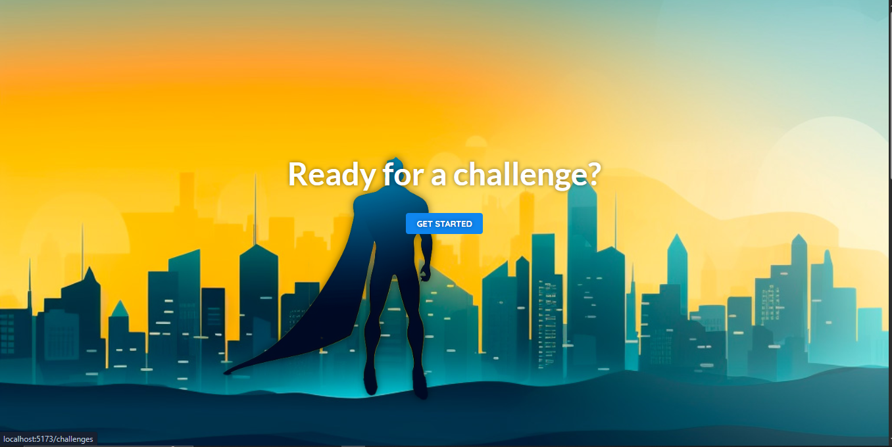
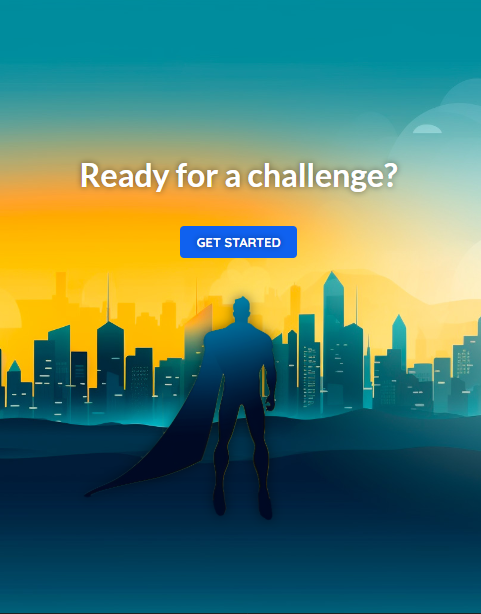
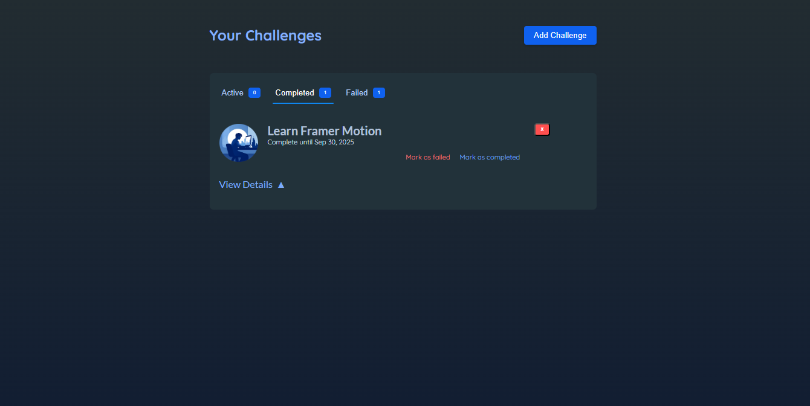
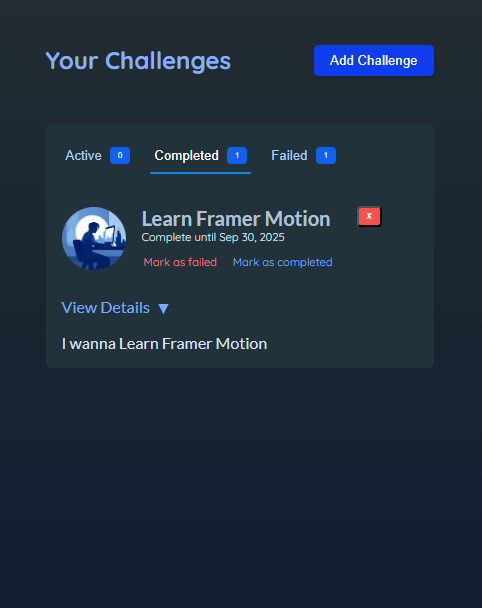

# 🏆 Challenge Tracker App

[](https://challenge-tracker-app-eta.vercel.app/)  
[](https://react.dev/)  
[](https://vitejs.dev/)  
[](https://redux-toolkit.js.org/)  
[](https://www.framer.com/motion/)

---

An interactive _challenge tracking application_ built with _React (Vite)_.  
This app allows you to _create challenges, set a **completion deadline, and later mark them as **completed_ or _failed_ when the time is up.

I originally built it while following Maximilian Schwarzmüller's React Course (Animation section with Framer Motion), but I took it further by:

- Making it _fully responsive_
- Replacing _Context API with Redux Toolkit_
- Adding extra _custom animations with Framer Motion_
- Persisting data with _Local Storage_
- Bootstrapped with _Vite_ for a faster dev experience 🚀

---

## 🚀 Features

- 📌 Add a new challenge with a title & deadline.
- ⏰ Countdown timer until challenge deadline.
- ✅ Mark challenges as _completed_.
- ❌ Mark challenges as _failed_ if not completed on time.
- 💾 Data persistence with _Local Storage_.
- 🎨 Smooth animations with _Framer Motion_.
- 📱 Fully _responsive design_.
- 🔄 State management powered by _Redux Toolkit_.

---

## 🛠 Tech Stack

- _React (Vite)_ – UI building & fast development
- _Redux Toolkit_ – State management
- _Framer Motion_ – Animations
- _Local Storage_ – Client-side persistence

---

## 📷 Screenshots

Example:

| Desktop View                                  | Mobile View                                        |
| --------------------------------------------- | -------------------------------------------------- |
|     |     |
|  |  |

---

## ⚙ Installation

1. Clone the repo:

   ```bash
   git clone https://github.com/ahmedmostafa-io/challenge-tracker.git
   cd challenge-tracker

   ```

2. Install dependencies:

npm install

3. Start development server:

npm run dev

4. Open in browser:

http://localhost:5173

---

📚 Learning Outcome

This project helped me practice:

Advanced React animations with Framer Motion.

Migrating app state from Context API → Redux Toolkit.

Persisting data with Local Storage.

Building responsive layouts with TailwindCSS.

Structuring real-world React projects with Vite.

---

🔮 Future Improvements

[ ] Add notifications/reminders before challenge ends.

[ ] Save challenges to a backend API.

[ ] Add filtering & sorting options.

[ ] Dark mode support.

---

👨‍💻 Author

Ahmed Mostafa Ahmed Abdel-Aal

[GitHub](https://github.com/ahmedmostafa-io)

[LinkedIn](https://www.linkedin.com/in/ahmed-mostafa-582378373/)

---
